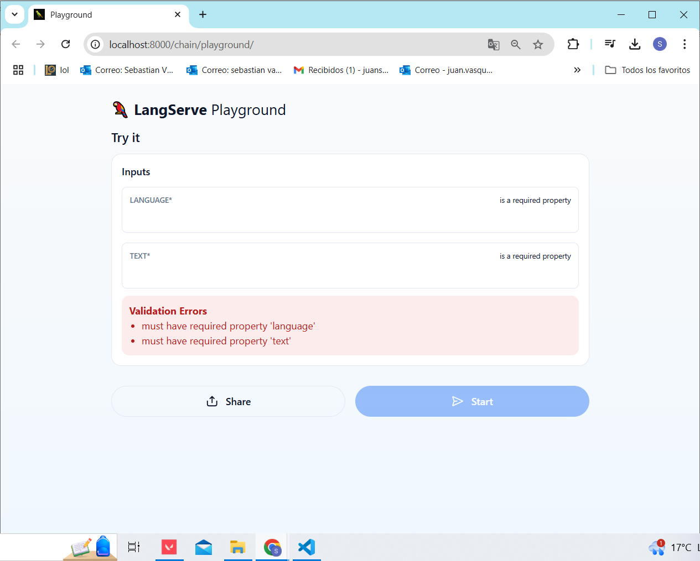

# LangChain Translation API Project

This project demonstrates a basic setup of a language translation API using LangChain and FastAPI. The project consists of three main components:

### 1. langchainbasicapp.ipynb
This Jupyter Notebook file contains an outline of the project setup, code explanations, and usage examples.

### 2. langchainclient.py
This Python client file uses `RemoteRunnable` to connect to the server API and send text for translation. It sends a request to the translation API at `localhost:8000/chain`, specifying the target language and text to be translated. The output is printed to the console.

### 3. langchainserver.py
This FastAPI server hosts the translation service. Key components include:
   - **Environment Setup**: Sets up the OpenAI API key to connect to the OpenAI model.
   - **Prompt Template**: Defines the translation prompt template using `ChatPromptTemplate` from LangChain, with placeholders for the target language and text input.
   - **Model and Parser**: Uses `ChatOpenAI` to access the OpenAI language model and `StrOutputParser` to process output text.
   - **Chain Creation and Route Addition**: Combines the template, model, and parser into a runnable chain, accessible via the `/chain` endpoint on the FastAPI server.

## Getting Started

These instructions will help you get a copy of the project up and running on your local machine for development and testing purposes.

### Prerequisites

You need to install the following tools and configure their dependencies:

1. **Python** (version 3.13 or higher)
    ```sh
    python --version
    ```
    Should return something like:
    ```sh 
    Python 3.13.0
    ```

2.  **Git**
    - Install Git by following the instructions [here](http://git-scm.com/book/en/v2/Getting-Started-Installing-Git)

    Verify the installation:
    ```sh
    git --version
    ```
    Should return something like:
    ```sh
    git version 2.25.1
    ```

## Installing

1. Clone the repository and navigate into the project directory:
    ```sh
    git clone https://github.com/Sebasvasquezz/LangChain-LLM-Chain-Tutorial.git
    cd LangChain-LLM-Chain-Tutorial
    ```
2. Before running the application you need to get the api key and replace it in the line:
    ```python
    os.environ["OPENAI_API_KEY"] = "YOUR_API_KEY_HERE"
    ```

3. To run the server, execute `langchainserver.py`:
    ```sh
    python langchainserver.py
    ```
    

    The application will start, and you can access the thefault web interface at `http://localhost:8000/chain/playground`.

    

3. And also you can use `langchainclient.py` to make translation requests.
    ```sh
    python langchainclient.py
    ```
    

## Architectural Diagram

### Diagram Explanation
- **Client**: `langchainclient.py` sends an HTTP request to the `/chain` endpoint.
- **Server**: The FastAPI application (`langchainserver.py`) handles the request. The request goes through:
  - **LangChain Prompt Template**: Defines the translation instructions.
  - **ChatOpenAI Model**: Uses OpenAI’s model for translation.
  - **StrOutputParser**: Parses the model’s response to return text output.
- **OpenAI API**: The server communicates with the OpenAI Language Model using an API key stored in an environment variable.

## Built With

* [Git](http://git-scm.com/) - Version Control System

## Versioning

I use [GitHub](https://github.com/) for versioning. For the versions available, see the [tags on this repository](https://github.com/Sebasvasquezz/LangChain-LLM-Chain-Tutorial.git).

## Authors

* **Juan Sebastian Vasquez Vega**  - [Sebasvasquezz](https://github.com/Sebasvasquezz)

## Date

November 7, 2024

## License

This project is licensed under the GNU License - see the [LICENSE.txt](LICENSE.txt) file for details.
